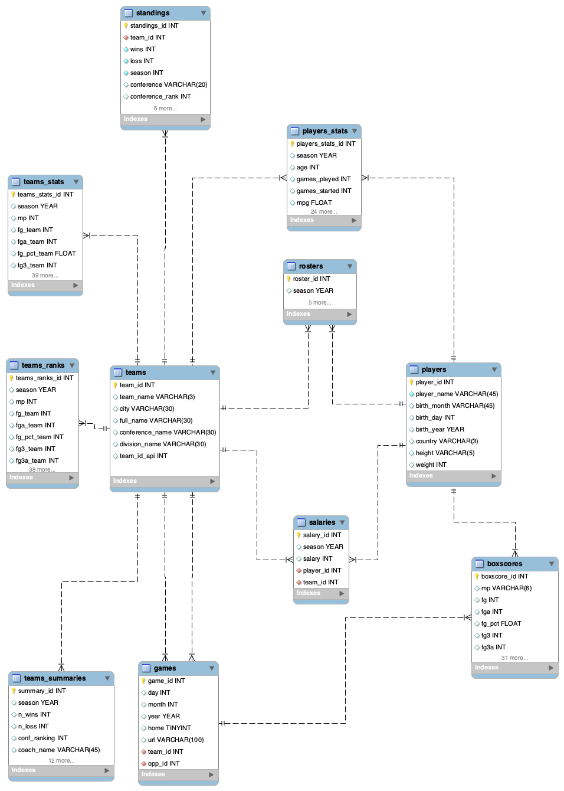

# ITC - Data Mining Project
## Scraping Basket Ball Reference website

In this project we have scraped the NBA [Basketball Reference](https://www.basketball-reference.com/teams/) website.

### Introduction
The NBA (National Basketball Association) is the most popular basketball league in the world. 
It is composed of 30 teams, divided in two conferences: the Western Conference and the Eastern Conferece.
Basketball reference is a website that gathers all the information regarding the NBA: player statistics, salaries, results, team statistics, boxscores...

### Our project
In this project, for each one of the 30 teams and for each season between (2008-2021), we scraped from basketball reference the following information
1. The season `summary` of the team: final rank of the regular season, coach, playoffs results and offensive and deffensive ratings, among others. 
2. The season `roster` of the team, listing all the players in the roster and their characteristics (height, weight, nationality, full name...)
3. The individual `statistics of the players` such as points per game, rebounds per game, steals per game, assists per game...
4. The `salary` of each player 
5. The `team and opponent statistics` that compares the statistics of each with all the competence.
6. The `team and opponent rank` that is analogue to nr 5 but with the rank.

Then for a selected year (that can be choosed from the Command Line), for each game played, we scraped the `basic` and `advanced` `boxscores` of both teams involved in the game. 
First we created a table with all the games played throughout that year (teams involved, date, link to the boxscore) and then we created another table with the boxscores related to each game. Those two outputs have a common `id` key.

### Contents of the repository
- `main.py` with the main program
- `requirements.txt` with the libraries needed
- `database folder` with the files related to the database creation:
       · `database_creation.py`: script of creation of the SQL database
       · `database_design.mwb`: EER diagram of the SQL database
       · `Database_design.png`: screenshot of the EER diagram of the SQL database
- `src folder` with all the functions needed for the main:
       · `conf.py` with the configuration constants
       · `scraping_team_season.py` where all the data scraping of the teams and seasons takes place.
       · `scraping_boxscores.py`  where all the data scraping of the games boxscores takes place.
       · `databse_insertion.py`  where all the inserion to the database takes place.
⚠️ In the `.gitignore` there is a `.env` file with the password of your MySQL that will allow you to work with SQL.
The file should look like this:
> password = your_password

### Tools
- [Beautiful Soup](https://beautiful-soup-4.readthedocs.io/en/latest/)
- [Requests](https://docs.python-requests.org/en/latest/)
- [GRequests](https://pypi.org/project/requests/)
- [json](https://docs.python.org/3/library/json.html)
- [csv](https://docs.python.org/3/library/csv.html)
- [pandas](https://pandas.pydata.org/docs/)
- [sys](https://docs.python.org/3/library/sys.html)
- [time](https://docs.python.org/3/library/time.html)
- [dotenv](https://www.npmjs.com/package/dotenv)
- [os](https://docs.python.org/3/library/os.html)
- [argparse](https://docs.python.org/3/library/argparse.html)
- [pymysql](https://pymysql.readthedocs.io/en/latest/)

### SQL DATABASE

### COMMAND LINE ARGUMENTS
Arguments: 
1. **Mandatory** `data_type` the table from team_season you want to scrape, the options are:
`['summaries', 'rosters', 'players_stats', 'teams_stats','teams_ranks', 'salaries', 'all']`
2. **Optional** `-boxscores` to scrape boxscores 
3. *Optional* `-t` the teams that you want to scrape, by default it's `all teams`
It has to be a team in the following list: 
`['UTA', 'IND', 'DET', 'DEN', 'LAL', 'GSW', 'BRK', 'PHI', 'MIL', 'CHI', 'WAS', 'SAS', 'MIA', 'OKC', 'DAL', 'CHO', 'SAC', 'NYK', 'POR', 'MIN', 'TOR', 'LAC', 'ORL', 'BOS', 'MEM', 'NOP', 'PHO', 'HOU', 'ATL', 'CLE']`
5. **Optional** `-s` the seasons that you want to scrape, by default it's `all years`. 
It has to be a year or several years from 2008 and 2021.

> Authors: Benjamin Dahan and Julieta Staryfurman 